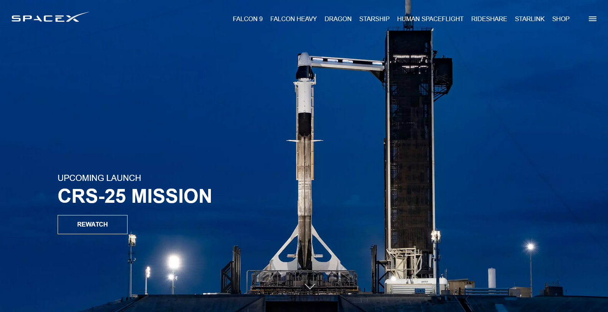

# SpaceX Website Clone

HTML/CSS/JS SpaceX website clone project from the [YouTube tutorial](https://www.youtube.com/watch?v=wryPX7KSwSc). It is not the entire website, but the homepage, a few inner pages with the CSS animations, mobile menu and the JavaScript countdown effect.

### Built with

- Semantic HTML5 markup
- CSS custom properties
- Flexbox
- CSS animations and transitions

### What I learned
I practiced css animations and transitions. I also learnt more about the multi-layering of elements on a page using the z-index. 

I learnt how to create the animated counter and to define its starting point when the page scrolls.

### Continued Development
I would like to recreate this page but use JavaScript to populate the homepage.
